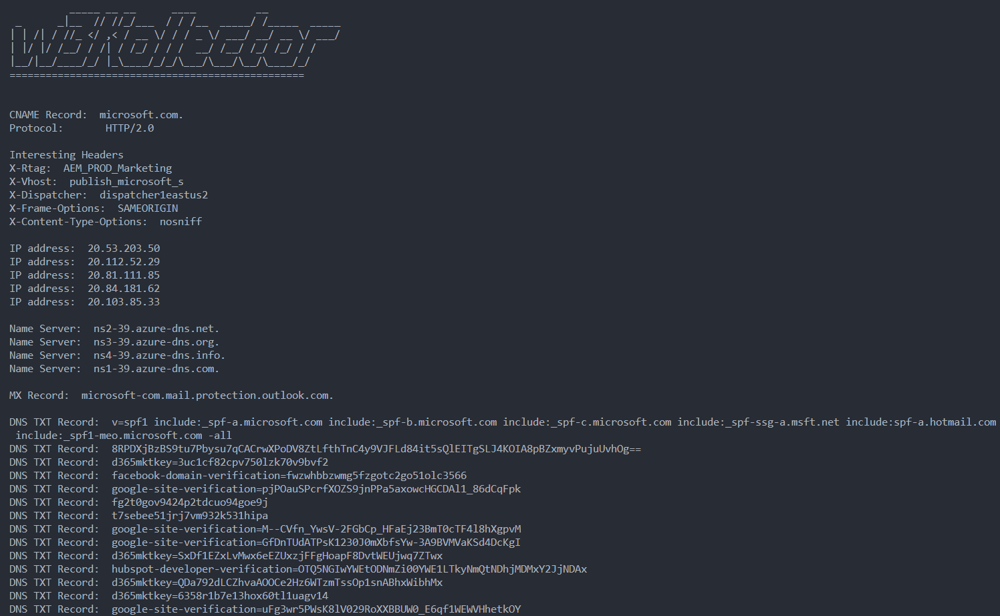

# w3Kollector
A greedy website scanner, scraper, and crawler.

Get everything from email addresses and phone numbers to PDFs and DNS records.
Search websites for keywords and phrases.

## Install

```
go install -v github.com/xenophonsec/w3kollector@latest
```

## Use

```
          _____ __ __      ____          __
 _      _|__  // //_/___  / / /__  _____/ /_____  _____
| | /| / //_ </ ,< / __ \/ / / _ \/ ___/ __/ __ \/ ___/
| |/ |/ /__/ / /| / /_/ / / /  __/ /__/ /_/ /_/ / /
|__/|__/____/_/ |_\____/_/_/\___/\___/\__/\____/_/
=================================================

NAME:
   w3kollector - scrape and scan websites

USAGE:
   w3kollector.exe [global options] command [command options] [arguments...]

VERSION:
   1.0.0

AUTHOR:
   Xenophonsec

COMMANDS:
   lookup, l  lookup domain name info, records and IP addresses
   scrape, s  scrape html
   search, q  Search website for specific text or html
   help, h    Shows a list of commands or help for one command

GLOBAL OPTIONS:
   --dontsave, --ds  Do not save results to files
   --help, -h        show help
   --version, -v     print the version
```

## Features

### Lookup

The lookup command fetches

- CNAME
- IP addresses
- Name servers
- MX records
- DNS TXT Records

```
w3kollector lookup microsoft.com
```


### Scrape

The scraper crawls websites and gathers contact info, meta data and various files. It refrains from following links outside of the target domain (but it will scan subdomains).

```
w3kollector scrape --help
```

```
          _____ __ __      ____          __
 _      _|__  // //_/___  / / /__  _____/ /_____  _____
| | /| / //_ </ ,< / __ \/ / / _ \/ ___/ __/ __ \/ ___/
| |/ |/ /__/ / /| / /_/ / / /  __/ /__/ /_/ /_/ / /
|__/|__/____/_/ |_\____/_/_/\___/\___/\__/\____/_/
=================================================

NAME:
   w3kollector scrape - scrape html

USAGE:
   w3kollector scrape [global options] command [command options] [arguments...]

VERSION:
   1.0.0

COMMANDS:
   site   site the website
   page   scrape a specific page

GLOBAL OPTIONS:
   --help, -h  show help
```

You can scrape a whole website with `scrape site` or a single page with the `scrape page` command.

```
w3kollector scrape site --help
```
```
          _____ __ __      ____          __
 _      _|__  // //_/___  / / /__  _____/ /_____  _____
| | /| / //_ </ ,< / __ \/ / / _ \/ ___/ __/ __ \/ ___/
| |/ |/ /__/ / /| / /_/ / / /  __/ /__/ /_/ /_/ / /
|__/|__/____/_/ |_\____/_/_/\___/\___/\__/\____/_/
=================================================

NAME:
   w3kollector scrape site - crawl the website and scrape it

USAGE:
   w3kollector scrape site [command options] [arguments...]

OPTIONS:
   --all, -a                                      Scrape everything     
   --emails, -e                                   Scrape email addresses
   --phones, -p                                   Scrape phone numbers
   --scripts, -s                                  Scrape scripts
   --stylesheets, --ss                            Scrape stylesheets
   --resourcelinks, --rl                          Scrape resource links
   --downloadpdfs, --dp                           Download pdfs
   --files                                        Download all downloadable files
   --logpdfs, --lp                                Log pdf urls
   --meta, -m                                     Scrape meta tags
   --search value, --find value, --lookfor value  Search html pages. This can be plain text or html you are looking for
   --out value, -o value                          What directory to place the output in. Default is current working directory
   --serverEngine, --se                           Get server engine names from HTTP headers
```


```
w3kollector scrape site --all microsoft.com
```


It collects
- Email Addresses
- Phone Numbers
- PDFs
- Downloadable files
- Outbound Links
- Scripts
- Stylesheets
- Resource Links (dns-prefetch, preconnect, canonical, alternate etc...)
- Meta data from meta tags
- Server Engine Types

It also
- builds a sitemap of pages visited
- logs http responses
- supports raw html text search

w3Kollector will write files to whatever directory you are currently in.

Output structure:
- website.com
  - files
    - setup.exe
  - pdfs
    - gettingstarted.pdf
  - outbound.txt
  - sitemap.txt
  - responses.txt
  - emailAddresses.txt
  - phoneNumbers.txt
  - scripts.txt
  - stylesheets.txt
  - resourceLinks.txt
  - metaTags.txt
  - search.txt
  - serverEngines.txt

> **Note:** files and folders are only created if that data is found

Resource links are stored with both the href and the rel attributes:
```
preconnect: https://fonts.gstatic.com
icon: /favicon.png
canonical: https://example.com/blog/
alternate: https://example.com/rss/
```

> **Note:** Only unique values are stored. If it finds the same phone number somewhere else it will be skipped.

If you provide a domain name and not a full url it will auto prefix https://
If you want to specify http you can do so likewise:
```
w3kollector scrape site --all http://website.com
```

## Search

### Search text
```
w3kollector search site --text="login" microsoft.com
```


### Search multiple keywords
```
w3kollector search site --keywords="login,signin,logout,signout" microsoft.com
```

