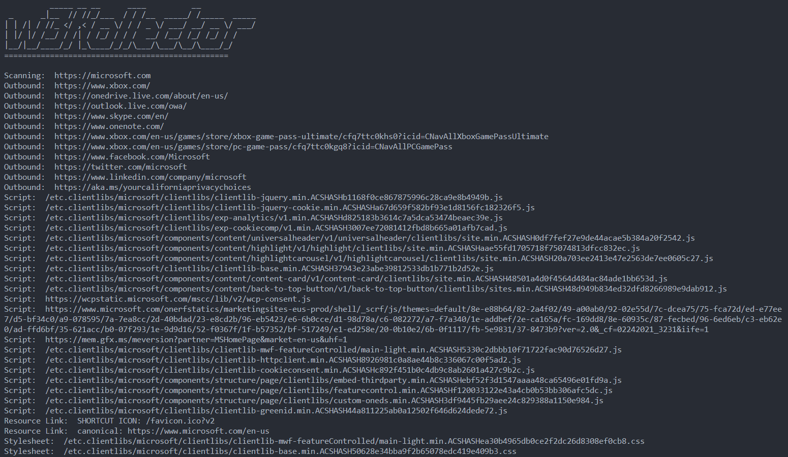

# w3Kollector
A greedy website scanner, scraper, and crawler.

Get everything from email addresses and phone numbers to PDFs and DNS records.
Search websites for keywords and phrases.

## Install

```
go install -v github.com/xenophonsec/w3kollector@latest
```

## Use

```
          _____ __ __      ____          __
 _      _|__  // //_/___  / / /__  _____/ /_____  _____
| | /| / //_ </ ,< / __ \/ / / _ \/ ___/ __/ __ \/ ___/
| |/ |/ /__/ / /| / /_/ / / /  __/ /__/ /_/ /_/ / /
|__/|__/____/_/ |_\____/_/_/\___/\___/\__/\____/_/
=================================================

NAME:
   w3kollector - scrape and scan websites

USAGE:
   w3kollector.exe [global options] command [command options] [arguments...]

VERSION:
   1.0.0

AUTHOR:
   Xenophonsec

COMMANDS:
   lookup, l  lookup domain name info, records and IP addresses
   scrape, s  scrape html
   search, q  Search website for specific text or html
   help, h    Shows a list of commands or help for one command

GLOBAL OPTIONS:
   --dontsave, --ds  Do not save results to files
   --help, -h        show help
   --version, -v     print the version
```

## Features

### Lookup

The lookup command fetches

- CNAME
- Protocol Used
- Web Server Details
- Interesting HTTP Headers
- Web Cert Details
- IP Addresses
- Name Servers
- MX Records
- DNS TXT Records

```
w3kollector lookup microsoft.com
```
```
         _____ __ __      ____          __
 _      _|__  // //_/___  / / /__  _____/ /_____  _____
| | /| / //_ </ ,< / __ \/ / / _ \/ ___/ __/ __ \/ ___/
| |/ |/ /__/ / /| / /_/ / / /  __/ /__/ /_/ /_/ / /
|__/|__/____/_/ |_\____/_/_/\___/\___/\__/\____/_/
=================================================


CNAME Record:  ibm.com.
Protocol:       HTTP/2.0
Server Engine:  Apache

X-Content-Type-Options:  nosniff
X-Xss-Protection:  1; mode=block
X-Akamai-Transformed:  9 16195 0 pmb=mTOE,2

Certificate(s)
Issuer Name: CN=DigiCert TLS Hybrid ECC SHA384 2020 CA1,O=DigiCert Inc,C=US
Expiry: 2023-February-08
Version: 3
Common Name: DigiCert TLS Hybrid ECC SHA384 2020 CA1
   ibm.com
   asmarterplanet.com
   bluewolf.com
   heal.ibm.com
   heal.ibm.org
   ibm.org
   ibm.ua
   ibm100.com
   ibmbigdatahub.com
   lendyr.com
   maas360.com
   truvenhealth.com
   www.asmarterplanet.com
   www.bluewolf.com
   www.ibm.com
   www.ibm.ua
   www.ibm100.com
   www.ibmbigdatahub.com
   www.lendyr.com
   www.maas360.com
   www.truvenhealth.com

Issuer Name: CN=DigiCert Global Root CA,OU=www.digicert.com,O=DigiCert Inc,C=US
Expiry: 2031-April-13
Version: 3
Common Name: DigiCert Global Root CA


IP address:  104.106.176.15

Name Server:  ns1-99.akam.net.
Name Server:  usc3.akam.net.
Name Server:  asia3.akam.net.
Name Server:  ns1-206.akam.net.
Name Server:  eur5.akam.net.
Name Server:  usw2.akam.net.
Name Server:  eur2.akam.net.
Name Server:  usc2.akam.net.

MX Record:  mx0a-001b2d01.pphosted.com.
MX Record:  mx0b-001b2d01.pphosted.com.

DNS TXT Record:  v=spf1 include:%{ir}.%{v}.%{d}.spf.has.pphosted.com ip4:148.163.158.5 ip4:148.163.156.1 ip4:67.231.145.127 ip4:67.231.153.87 ip4:168.245.101.145 mx a:zgateway.zuora.com include:_spf.google.com ~all
DNS TXT Record:  _github-challenge-ibm.ibm.com=2613e984bc
DNS TXT Record:  h1-domain-verification=m9jGKLYa5hDdU5AHUfK9jrBmWVhx3h9t9ztfDFMaxZfgChvk
DNS TXT Record:  00df40000004784eaa
DNS TXT Record:  google-site-verification=Jck8mLbYYfCnrmi_nRy4MG2fbUN3UGhC29KdspGLd9Y
DNS TXT Record:  atlassian-domain-verification=WAjTH82C5Zx475WLKAA2nrdlsoA/kN0ej9igrLrED4h15KMHPOm+A5H3GndKAxDC
DNS TXT Record:  google-site-verification=tzdngH5fWH-k8uQoDVovOFJQZTwaGtDOP6S2cQlOvCs
DNS TXT Record:  adobe-idp-site-verification=5f8adca7-512f-44e1-a5b2-b62c5e3763f2
DNS TXT Record:  mongodb-site-verification=3d0wR0KvanH3yTbll0sXEJ0QGBQffOkv
DNS TXT Record:  amazonses:79ShwQazteb+WkCt8e297sAC2mwZVRditsrzaoxiHjU=
DNS TXT Record:  40a21f5affe343c6b37e0a5af80dcd93
DNS TXT Record:  yandex-verification: 5f458b477256c50c
DNS TXT Record:  google-gws-recovery-domain-verification=42135076
DNS TXT Record:  docker-verification=7c4d4e40-e7ee-4183-94c2-db97d0873269
DNS TXT Record:  google-site-verification=aH5jG_abrxRKeKZKOrX9CuXlXdFSCQxVkmAVoYwzNcc
DNS TXT Record:  MS=ms61389031
DNS TXT Record:  facebook-domain-verification=kyuxs3tdqtyh9rbqa3szkq3k9i2bbs
DNS TXT Record:  apple-domain-verification=M3o953J0rN1B0P2a
DNS TXT Record:  onetrust-domain-verification=e7e09cedfb9b4ff386f1274e4c214d55
DNS TXT Record:  Dynatrace-site-verification=76b6b299-fe43-4f31-889b-a8a467193478__8q74sg9dg5udjppn95utrb8bct
DNS TXT Record:  atlassian-domain-verification=a32Aj0uoXQRh6QseDFFrlufYlkbeSdok7az3sY0DQNVXpW1Iqj8zlsuXFZgHMojH
DNS TXT Record:  00d00000000hedieay
DNS TXT Record:  00d50000000c9mweay
DNS TXT Record:  00D3h000004YkeYEAS
DNS TXT Record:  smartsheet-site-validation=I-lI3gCPdvKbKQ6KTki96Ream6Yjs1gU
```

### Scrape

The scraper crawls websites and gathers contact info, meta data and various files. It refrains from following links outside of the target domain (but it will scan subdomains).

```
w3kollector scrape --help
```

```
          _____ __ __      ____          __
 _      _|__  // //_/___  / / /__  _____/ /_____  _____
| | /| / //_ </ ,< / __ \/ / / _ \/ ___/ __/ __ \/ ___/
| |/ |/ /__/ / /| / /_/ / / /  __/ /__/ /_/ /_/ / /
|__/|__/____/_/ |_\____/_/_/\___/\___/\__/\____/_/
=================================================

NAME:
   w3kollector scrape - scrape html

USAGE:
   w3kollector scrape [global options] command [command options] [arguments...]

VERSION:
   1.0.0

COMMANDS:
   site   site the website
   page   scrape a specific page

GLOBAL OPTIONS:
   --help, -h  show help
```

You can scrape a whole website with `scrape site` or a single page with the `scrape page` command.

```
w3kollector scrape site --help
```
```
          _____ __ __      ____          __
 _      _|__  // //_/___  / / /__  _____/ /_____  _____
| | /| / //_ </ ,< / __ \/ / / _ \/ ___/ __/ __ \/ ___/
| |/ |/ /__/ / /| / /_/ / / /  __/ /__/ /_/ /_/ / /
|__/|__/____/_/ |_\____/_/_/\___/\___/\__/\____/_/
=================================================

NAME:
   w3kollector scrape site - crawl the website and scrape it

USAGE:
   w3kollector scrape site [command options] [arguments...]

OPTIONS:
   --all, -a                                      Scrape everything     
   --emails, -e                                   Scrape email addresses
   --addresses, --ad                              Scrape addresses
   --phones, -p                                   Scrape phone numbers
   --scripts, -s                                  Scrape scripts
   --stylesheets, --ss                            Scrape stylesheets
   --resourcelinks, --rl                          Scrape resource links
   --downloadpdfs, --dp                           Download pdfs
   --files                                        Download all downloadable files
   --logpdfs, --lp                                Log pdf urls
   --meta, -m                                     Scrape meta tags
   --search value, --find value, --lookfor value  Search html pages. This can be plain text or html you are looking for
   --out value, -o value                          What directory to place the output in. Default is current working directory
   --serverEngine, --se                           Get server engine names from HTTP headers
```


```
w3kollector scrape site --all microsoft.com
```


It collects
- Email Addresses
- Phone Numbers
- Mail addresses
- PDFs
- Downloadable files
- Outbound Links
- Scripts
- Stylesheets
- Resource Links (dns-prefetch, preconnect, canonical, alternate etc...)
- Meta data from meta tags
- Server Engine Types

It also
- builds a sitemap of pages visited
- logs http responses
- supports raw html text search

w3Kollector will write files to whatever directory you are currently in.

Output structure:
- website.com
  - files
    - setup.exe
  - pdfs
    - gettingstarted.pdf
  - outbound.txt
  - sitemap.txt
  - responses.txt
  - emailAddresses.txt
  - phoneNumbers.txt
  - scripts.txt
  - stylesheets.txt
  - resourceLinks.txt
  - metaTags.txt
  - search.txt
  - serverEngines.txt
  - addresses.txt

> **Note:** files and folders are only created if that data is found

Resource links are stored with both the href and the rel attributes:
```
preconnect: https://fonts.gstatic.com
icon: /favicon.png
canonical: https://example.com/blog/
alternate: https://example.com/rss/
```

> **Note:** Only unique values are stored. If it finds the same phone number somewhere else it will be skipped.

If you provide a domain name and not a full url it will auto prefix https://
If you want to specify http you can do so likewise:
```
w3kollector scrape site --all http://website.com
```

If you don't want to save any data to files you can use the **--dontsave**(-ds) flag.
```
w3kollector --dontsave scrape site --all example.com
```

## Search

### Search text
You can search a website for specific text using the text flag (or -t).
```
w3kollector search site --text="api" microsoft.com
```
> **Note:** the search command will search html and javascript files alike.

### Search multiple keywords
You can search multiple keywords or phrases at the same time with the keywords flag (or -k).
```
w3kollector search site --keywords="login,log in,logout" microsoft.com
```

