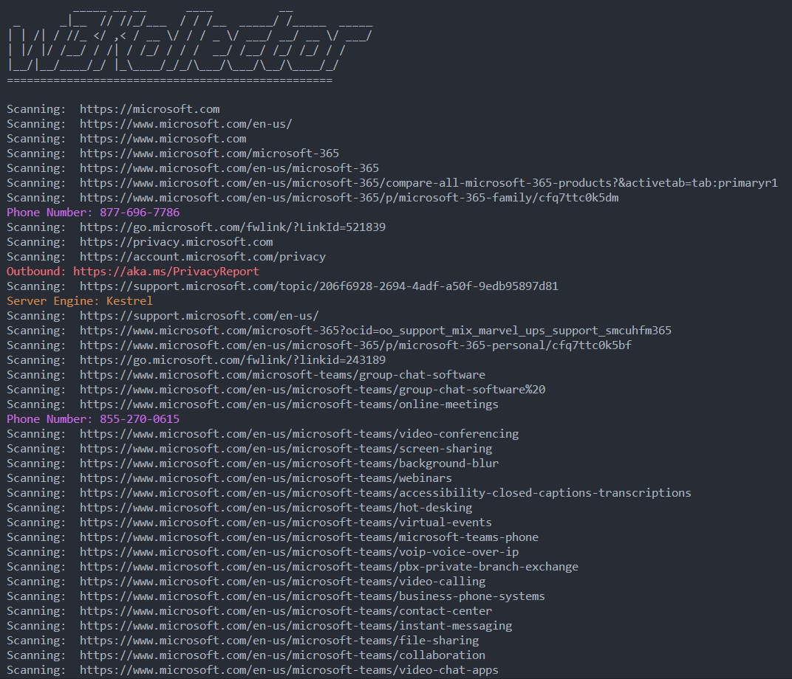

# w3Kollector
A greedy website scanner, scraper, and crawler.

Get everything from email addresses and phone numbers to PDFs and DNS records.

## Install

```
go install -v github.com/xenophonsec/w3kollector@latest
```

## Use


## Features

### Scrape

The scraper crawls websites and gathers contact info, meta data and various files. It refrains from following links outside of the target domain (but it will scan subdomains).

```
w3kollector scrape microsoft.com
```


It collects
- Email Addresses
- Phone Numbers
- PDFs
- Downloadable files
- Outbound Links

It also
- builds a sitemap of pages visited
- logs http responses

w3Kollector will write files to whatever directory you are currently in.

Output structure:
- website.com
  - files
    - setup.exe
  - pdfs
    - gettingstarted.pdf
  - outbound.txt
  - sitemap.txt
  - responses.txt
  - emailAddresses.txt
  - phoneNumbers.txt

> **Note:** files and folders are only created if that data is found

emailAddresses.txt and phoneNumbers.txt store the address and number along with the page it was found on:
```
dave@example.com : example.com/meettheteam
carol@example.com : example.com/meettheteam
team@example.com : example.com/contact
contactus@example.com : example.com/contact
```

```
243-989-3342 : example.com/meettheteam
243-433-3643 : example.com/meettheteam
243-119-9933 : example.com/contact
```

> **Note:** Only unique values are stored. If it finds the same phone number somewhere else it will be skipped.

If you provide a domain name and not a full url it will auto prefix https://
If you want to specify http you can do so likewise:
```
w3kollector scrape http://website.com
```

### Lookup

The lookup command fetches

- CNAME
- IP addresses
- Name servers
- MX records
- DNS TXT Records

```
w3kollector lookup microsoft.com
```
